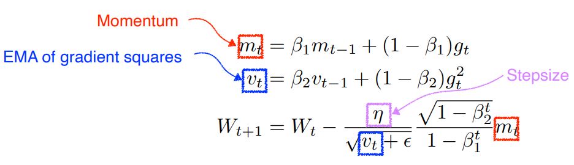

# 오늘 공부한 내용📝

 

# Multi - Layer Perceptron

 

# Optimization

- Adam

1. **첫 번째 모멘트(First Moment, m)**

   과거의 모든 경사에 가중치를 부여하는 누적 평균을 취한다. 이는 경사의 방향을 더 안정적으로 반든다. 또한 전통적인 모멘텀 방식과 유사하게 최적점으로 더 빠르고 안정적인 수렴을 도운다.

2. **두 번째 모멘트(Second Moment, v)**

   감쇠 계수인 베타가 제곱되는 것은 경사의 분산을 추정하는 것이다. 이는 매개변수의 업데이트가 너무 크거나 작을 때, 이 분산 추정치가 업데이트를 조절하는데 도움을 준다. 따라서 높은 분산을 가진 매개변수는 더 작은 업데이트를, 낮은 분산을 가진 매개변수는 더 큰 업데이트를 받게 된다. 
   
    

 **※** 여기서 두 모멘트에서 사용된 Exponential Moving Average(EMA)는 과거 데이터의 가중치가 시간이 지남에 따라 지수적으로 감소하는 방식으로 평균을 계산하는 방법이다.

 

# CNN

 

# 참고 사이트

1. [Deep Learning ideas that have stood the test of time &#183; Denny's Blog](https://dennybritz.com/posts/deep-learning-ideas-that-stood-the-test-of-time/)

2. [Intro to optimization in deep learning: Momentum, RMSProp and Adam](https://blog.paperspace.com/intro-to-optimization-momentum-rmsprop-adam/)

3. [12.6. Momentum &#8212; Dive into Deep Learning 1.0.3 documentation](https://d2l.ai/chapter_optimization/momentum.html)

 

# 회고🤔

퇴실만 하면 항상 힘이 빠진다... 할게 많이 있음에도... 안하게되는 것 같다.  
